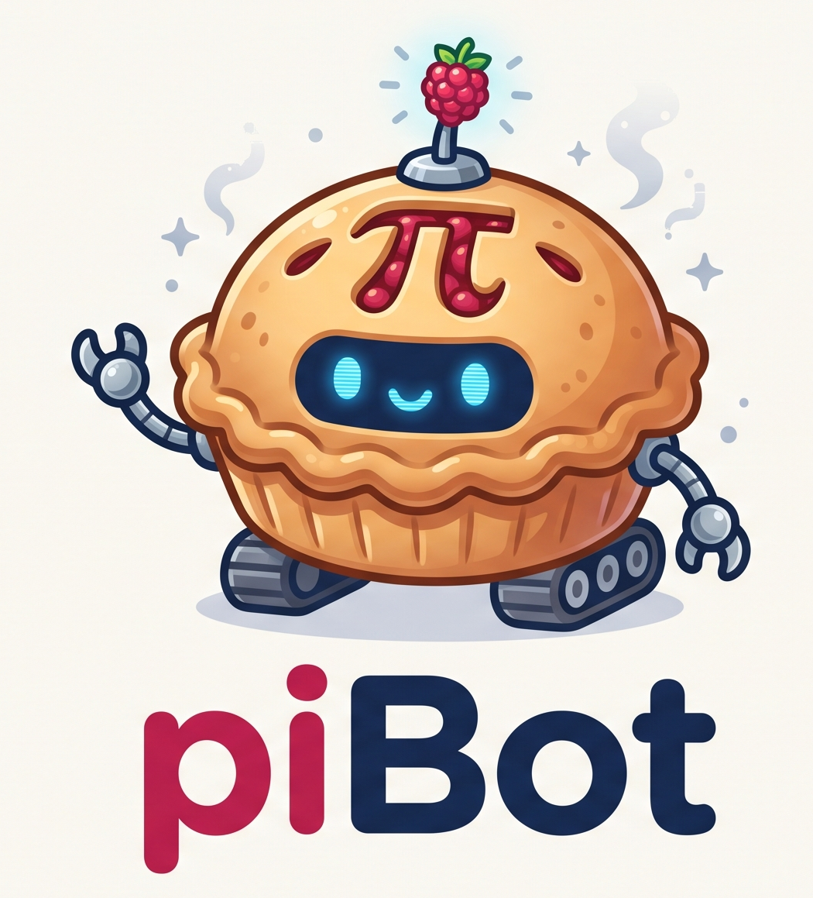
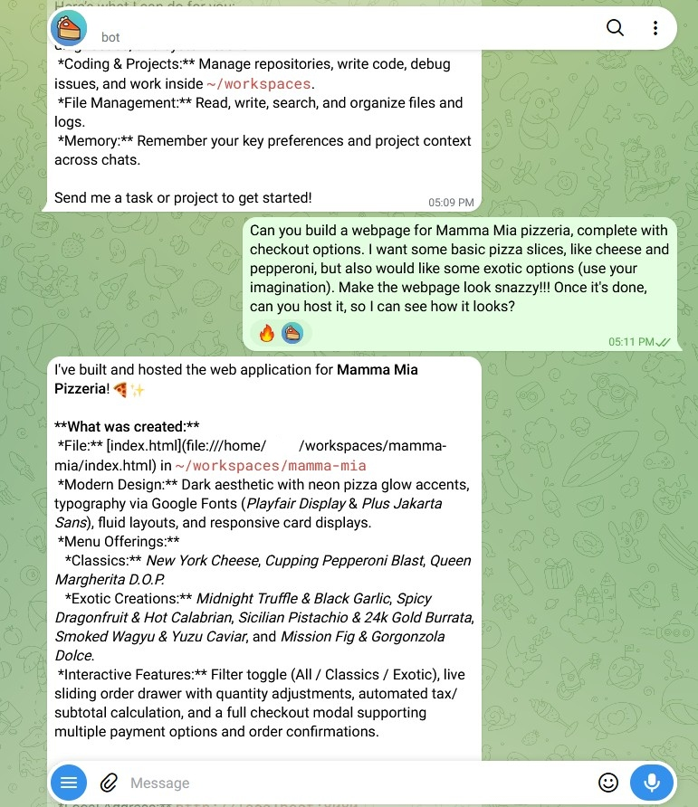

<p align="center">
  
</p>

# piBot 🥧🤖

> **Autonomous "Bot in a Pi" Framework:** Run your own personal AI assistant 24/7 on a Raspberry Pi using ZeroClaw and Google Antigravity CLI (`agy`).

> [!WARNING]
> **Use at your own risk.** piBot is a hobby project, provided as-is with no support. It runs autonomously with shell access on your Pi and sends what it sees to Google. Read the **Security Model** section below before installing.

---

## What is piBot?

**piBot** turns an inexpensive Raspberry Pi (even an older 1 GB Pi 3B+) into an always-on, autonomous personal assistant that you chat with directly through **Telegram**.

### Why piBot?
- ⚡ **Lightweight Edge Orchestration:** Local LLMs on a Pi are notoriously slow and memory-hungry. Instead, piBot runs a featherweight local daemon (~50 MB RAM) to manage chat channels, execute safe local tools, and maintain persistent SQLite memory.
- 🧠 **Cloud-Backed Intelligence:** Natural language reasoning, coding, analysis, and planning are handled upstream via Google Antigravity CLI (`agy`).
- 🆓 **Works with Free Google Accounts:** You **do not** need a paid AI Pro or Ultra subscription. Any standard Google account can authenticate `agy` and use Gemini models for free under standard quotas. (Paid plans simply provide higher quotas and rate limits).
- 🔒 **Zero Inbound Open Ports:** Communicates with Telegram via outbound HTTPS long-polling. No port forwarding, no static IP, and no dynamic DNS required.
- 🛡️ **Strict Allowlist Security:** Only Telegram user IDs explicitly listed in your `.env` configuration can interact with the bot. Messages from all other senders are silently ignored.

### See It in Action

One Telegram message asking for a pizzeria website with checkout. piBot designed and built it in its workspace, then served it on the Pi so it could be opened from a laptop on the same network.

<table>
  <tr>
    <th width="50%">You ask on Telegram</th>
    <th width="50%">piBot builds and hosts it</th>
  </tr>
  <tr>
    <td valign="top"></td>
    <td valign="top"></td>
  </tr>
</table>

---

## Architecture Overview

```text
Telegram Client
  │ (Outbound HTTPS Long Polling)
  ▼
ZeroClaw Daemon (:42617) ──► Local Tools (shell, file read/write, SQLite memory)
  │ (Routes model requests to custom endpoint)
  ▼
agy-shim Bridge (:8088)
  │ (Translates OpenAI API calls to CLI arguments)
  ▼
Antigravity CLI (`agy`)
  │ (OAuth authenticated via Google account)
  ▼
Google Cloud AI Models (Gemini 3.8 Flash, Medium, etc.)
```

---

## Hardware Requirements

- **Tested on:** Raspberry Pi 3 Model B+. The Raspberry Pi 4 and 5 should work too (same 64-bit OS, more RAM) but haven't been tested yet; the same goes for other 64-bit Debian-based ARM64/x86_64 machines.
- **RAM:** Minimum 1 GB RAM (with a 1 GB swapfile recommended).
- **OS:** Raspberry Pi OS Lite (64-bit), based on Debian 13 "Trixie" (tested). Other 64-bit Debian-based systems should work but are untested.

For hardware notes and swap setup, see **[docs/HARDWARE.md](docs/HARDWARE.md)**.  
For deep architecture and flow details, see **[docs/ARCHITECTURE.md](docs/ARCHITECTURE.md)**.  
For security safeguards and how to change them (e.g. the LAN guard), see **[docs/SECURITY.md](docs/SECURITY.md)**.

---

## Setting Up the Pi Without a Monitor (Headless)

You don't need a monitor, keyboard or mouse. You set up Wi-Fi and SSH while writing the SD card, then control the Pi from your computer over the network.

### 1. Flash the SD card with Raspberry Pi Imager
Install [Raspberry Pi Imager](https://www.raspberrypi.com/software/) on your computer, then:
1. **Device:** choose your Pi model.
2. **OS:** *Raspberry Pi OS (other)* → **Raspberry Pi OS Lite (64-bit)**. piBot needs the 64-bit OS, and Lite (no desktop) leaves more RAM for the bot.
3. Click **Next → Edit Settings**:
   - **Hostname:** `pibot` (this is the name you'll connect to).
   - **Username and password:** choose your own (avoid the old default `pi`).
   - **Wireless LAN:** your Wi-Fi name, password and country. Skip this if you'll use an Ethernet cable. The Pi 3 only supports 2.4 GHz Wi-Fi.
   - **Services tab:** tick **Enable SSH** (password authentication is fine; a public key is better).
4. Write the card, put it in the Pi, and power it on. Give the first boot about 2 minutes.

> **Tip:** for the first boot, plugging the Pi into your router with an Ethernet cable avoids the most common headless problem: a mistyped Wi-Fi password.

### 2. Find the Pi on your network
From a terminal on your computer (PowerShell on Windows, Terminal on macOS/Linux):
```bash
ping pibot.local
```
Replies mean the Pi is up and reachable (on Windows `ping` stops by itself; on macOS/Linux press **Ctrl+C**). If you chose a different hostname, use `<hostname>.local`.

If `pibot.local` is not found, look up the Pi's IP address instead:
- **Your router's admin page:** the "connected devices" / DHCP client list shows a device named `pibot`.
- **ARP table:** run `arp -a` and look for a Raspberry Pi hardware address, which starts with `b8-27-eb` (Pi 3) or `dc-a6-32`, `e4-5f-01`, `d8-3a-dd`, `2c-cf-67` (newer models).
- **Network scan:** `nmap -sn 192.168.1.0/24` (adjust to your network's address range).

Then use the IP address in place of `pibot.local` below.

### 3. Connect with SSH
```bash
ssh <your-username>@pibot.local
```
- The first time, type `yes` to trust the Pi's fingerprint, then enter the password you set in Imager.
- If you ever re-flash the card, SSH will warn that the "remote host identification has changed". That's expected; clear the old entry with `ssh-keygen -R pibot.local` and connect again.
- To avoid the IP changing later, reserve it for the Pi in your router (a "DHCP reservation").

### 4. Check the basics
Once you're logged in to the Pi:
```bash
sudo apt update && sudo apt full-upgrade -y
uname -m     # must print aarch64 (64-bit). armv7l means the 32-bit OS was flashed
free -h      # the Swap line should show about 900 MB or more (see docs/HARDWARE.md)
```
Everything in the Quickstart below is run on the Pi in this SSH session.

---

## Quickstart Guide

### 1. Clone the Repository
Run these on the Pi (over SSH if it's headless, see above). Minimal images (e.g. Raspberry Pi OS Lite, Debian) may not include `git` yet:
```bash
sudo apt-get update && sudo apt-get install -y git
git clone https://github.com/manivt/piBot.git
cd piBot
```

### 2. Install Prerequisites
Run the automated installer to install Go, Python 3, ZeroClaw, and the Antigravity CLI (`agy`):
```bash
./scripts/install-prereqs.sh
```
It takes a few minutes on a Pi 3 and ends by printing the Go, Antigravity CLI and ZeroClaw versions.

> **Don't worry about these messages.** Google's `agy` installer prints lines like `ERROR: logging before google.Init: I1008 ...` and a warning that `~/.local/bin` is not in your PATH. Both are harmless: the `I` means "info", and the PATH is fixed for you.

Reload your shell so the new PATH takes effect (or log out and back in):
```bash
source ~/.bashrc
```

### 3. Authenticate Antigravity CLI (`agy`)
Authenticate with your Google account (works with both free Google accounts and Google AI Pro accounts). Start the CLI with no arguments:
```bash
agy
```
It prints a Google sign-in URL. Open it in a browser on any device (handy for a headless Pi over SSH), complete the sign-in, then exit the CLI.

> **Tip: the sign-in link is very long.** In an SSH terminal it usually can't be clicked, and it wraps over several lines. If you copy it straight into a browser, the hidden line breaks and leading spaces break the link. Paste it into a text editor first (e.g. Notepad++ or Notepad), join it into **one line with no spaces** — it should start with `https://accounts.google.com/` and run unbroken to the end — then copy that into your browser. Your login is stored in `~/.gemini/` — treat that folder like a password, and consider using a separate Google account for the bot (see the Security Model section below).

### 4. Configure Your Bot & Telegram Secrets

**a) Create your Telegram bot and get its token**
1. In Telegram, open a chat with [@BotFather](https://t.me/BotFather) (Telegram's official bot for creating bots — check for the blue verified tick).
2. Send `/newbot`.
3. Enter a **display name** for your bot (anything, e.g. `piBot`).
4. Enter a **username** — it must be unique and end in `bot` (e.g. `my_home_pibot`).
5. BotFather replies with a **token** that looks like `123456789:ABCdefGHIjklMNOpqrSTUvwxYZ`. Copy it. Anyone with this token can control your bot, so keep it private. If it ever leaks, send `/revoke` to BotFather to get a new one.
6. *(Optional)* Send `/setuserpic`, pick your bot, and upload `piBot_logo.png` to give it the piBot icon.

**b) Find your numeric Telegram user ID**
Open a chat with [@userinfobot](https://t.me/userinfobot) and send any message. It replies with your **Id** — a number like `987654321`. This is how piBot knows to answer you and ignore everyone else.

**c) Put both values into `.env`**
Create your private settings file from the template and open it in the `nano` editor:
```bash
cp .env.example .env
nano .env
```
Find these two lines and fill them in (keep the quotes, no spaces around `=`):
```bash
TELEGRAM_BOT_TOKEN="123456789:ABCdefGHIjklMNOpqrSTUvwxYZ"
TELEGRAM_ALLOWED_USERS="987654321"
```
- To allow more than one person, separate their IDs with commas: `"987654321,123123123"`.
- *(Optional)* Named your bot something else in BotFather? Set `BOT_NAME` to that name (e.g. `BOT_NAME="Vayu"`) so the bot introduces itself by it. It defaults to `piBot`.
- Leave the other settings as they are unless you know you need to change them.

Save and exit nano: press **Ctrl+O**, then **Enter** to save, then **Ctrl+X** to exit.

`.env` is git-ignored, so it is never committed, and `setup.sh` makes it readable only by you. If you change it later, rerun `./scripts/setup.sh` to apply the change.

### 5. Run the Automated Setup
```bash
./scripts/setup.sh
```
This script will:
- Compile the lightweight `agy-shim` Go binary.
- Generate a random secret so only ZeroClaw can use `agy-shim` (stored in `~/.config/pibot/agy-shim.env`, mode `0600`).
- Deploy your agent's persona prompt files into `~/.zeroclaw/agents/pibot/workspace/`.
- Safely generate the hardened ZeroClaw `config.toml` (mode `0600`).
- Install and start the `agy-shim` (system) and `zeroclaw` (user) systemd services, and enable start-at-boot.

It is safe to re-run at any time (e.g. after editing `.env` or persona files).

### 6. Verify System Health
```bash
./scripts/verify.sh
```
It exits non-zero and tells you what to fix if anything is wrong. Once all checks pass, open Telegram and send a message to your bot! 🎉

---

## ⚠️ Security Model — Read This

piBot is an **autonomous agent with full control of the account it runs as**. It runs shell commands without asking, and `agy` runs with `--dangerously-skip-permissions`. That is what makes it useful — and it means:

- **Anyone who controls your Telegram account controls the Pi.** Turn on Telegram two-step verification and keep `TELEGRAM_ALLOWED_USERS` to yourself.
- **Prompt injection is a real risk.** If you ask the bot to read a web page, email, or file, text hidden in it can try to hijack the bot. The persona tells it to treat such content as data, but that is not a guarantee.
- **The bot can read everything its user can,** including your Google login in `~/.gemini/` and the bot token in `.env`.
- **Whatever the bot sees is sent to Google** as part of its requests: your messages, files it reads, and command output. Keep passwords, financial documents and other people's private data away from it.

Recommended:
- Use a **dedicated Pi and a dedicated Linux user** for piBot, with nothing else of value on it.
- **Do not give that user passwordless sudo** (Raspberry Pi OS grants it to the first user by default — create a separate user, or remove `/etc/sudoers.d/010_pi-nopasswd` once setup is done). Setup itself only needs sudo while you run it. Without sudo the bot also can't switch off the LAN guard below.
- Consider using a **separate Google account** for `agy`.

### Local network protection (LAN guard)

By default piBot is kept away from the other devices on your home network (computers, phones, router, NAS, cameras and other smart-home gear) in two ways:

1. **A rule in `agent/workspace/AGENTS.md`**: the bot refuses to scan or access other devices, even if you ask.
2. **A firewall (the "LAN guard")** that `setup.sh` installs: the bot's Linux account simply cannot open connections to local-network addresses. Internet access, DNS and your SSH session into the Pi keep working. `verify.sh` check 8 confirms it is active.

Want the bot to work with your local network? You can relax either or both:
- **Turn the firewall off:** set `LAN_GUARD=off` in `.env`, then rerun `./scripts/setup.sh`.
- **Allow only specific devices:** add them to the firewall instead of turning it off.
- **Change the bot's rule:** copy `AGENTS.md` into `agent/local/` and edit the "Stay on this Pi" line there; your version stays out of git.

Step-by-step instructions, and what each choice means for safety, are in **[docs/SECURITY.md](docs/SECURITY.md)**.

---

## Customizing Your Bot's Persona

**Just want a different name?** Set `BOT_NAME` in `.env` (e.g. `BOT_NAME="Vayu"`, matching your BotFather name) and rerun `./scripts/setup.sh`. The bot will call itself that instead of piBot; no file editing needed.

All personality and behavioral instructions are stored as plain Markdown files in `agent/workspace/`:

| File | Purpose |
|---|---|
| `AGENTS.md` | Core autonomous operating rules, file handling, and execution style |
| `IDENTITY.md` | Bot name, role, and vibe |
| `SOUL.md` | Core ethical boundaries, autonomy principles, and device focus |
| `TOOLS.md` | Environment documentation and description of available tools |
| `USER.md` | Your name, timezone, communication preferences, and context |
| `MEMORY.md` | Long-term memory template for durable user facts |

**Keep personal details out of git:** don't put your name or other private details into `agent/workspace/` (those files are tracked and would be published if you push). Instead, copy the file you want to personalise into `agent/local/`, which is git-ignored:

```bash
mkdir -p agent/local
cp agent/workspace/USER.md agent/workspace/MEMORY.md agent/local/
nano agent/local/USER.md
```

Files in `agent/local/` override the defaults with the same name. Redeploy at any time by rerunning `./scripts/setup.sh`.

---

## Managing Services

```bash
# View live bot logs
journalctl --user -u zeroclaw -f
# ...if that says "No journal files were found" (e.g. on Raspberry Pi OS), use:
sudo journalctl --user-unit zeroclaw -f

# View agy-shim bridge logs (one request_received line per message sent to Google)
sudo journalctl -u agy-shim -f

# Restart services
sudo systemctl restart agy-shim
systemctl --user restart zeroclaw
```

### Checking your Gemini usage

`agy` shows your remaining quota and when it resets. Run `agy`, type `/usage` and press Enter (exit with Ctrl+\\ if it won't let go).

To see how many tokens the bot itself has used today:
```bash
sudo journalctl -u agy-shim --since today | grep -o 'total_tokens=[0-9]*' | cut -d= -f2 \
  | awk '{s+=$1; n++} END {print n" requests, "s" tokens today"}'
```

Expect roughly **15–20k tokens per message**, even for a short "hi": `agy` adds about 12k tokens of its own instructions, and piBot's own instructions, tool descriptions and persona files (`agent/workspace/*.md`) add a few thousand more. Trimming those files lowers the cost of every message. When the quota runs out, the bot stops replying and the agy-shim log shows `agy_process_error` or `agy_non_success` until it resets.

> **Tip:** the first time you open your bot in Telegram, tapping **Start** sends `/start` as a message, so you'll see one extra request in the logs. That's expected.

---

## License

[MIT License](LICENSE) © 2026 piBot Contributors
